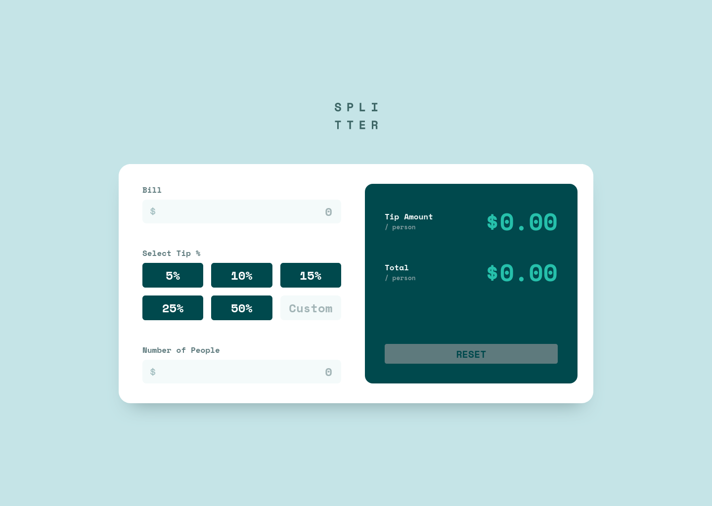
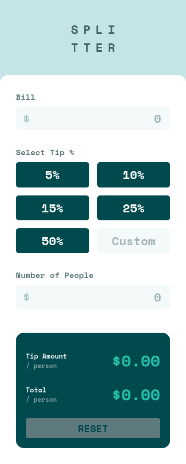

# Frontend Mentor - Tip calculator app solution

This is a solution to the [Tip calculator app challenge on Frontend Mentor](https://www.frontendmentor.io/challenges/tip-calculator-app-ugJNGbJUX). Frontend Mentor challenges help you improve your coding skills by building realistic projects.

## Table of contents

- [Overview](#overview)
  - [The challenge](#the-challenge)
  - [Screenshot](#screenshot)
  - [Links](#links)
- [My process](#my-process)
  - [Built with](#built-with)
  - [What I learned](#what-i-learned)
  - [Continued development](#continued-development)
  - [Useful resources](#useful-resources)
- [Author](#author)

## Overview

### The challenge

Users should be able to:

- View the optimal layout for the app depending on their device's screen size
- See hover states for all interactive elements on the page
- Calculate the correct tip and total cost of the bill per person

### Screenshot

#### Desktop:

#### Mobile:

### Links

- Solution URL: Coming soon
- Live Site URL: [https://resonant-alfajores-b9a524.netlify.app/](https://resonant-alfajores-b9a524.netlify.app/)

## My process

### Built with

- Semantic HTML5 markup
- CSS custom properties
- Flexbox
- CSS Grid
- [React](https://reactjs.org/) - JS library
- [Styled Components](https://styled-components.com/) - For styles

### What I learned

With this challenge I learned how to use Styled Components, probably the easiest (though most likely not the most efficient) way to restrict the input on text inputs to numbers and how to format numbers into currency strings using the built-in javascript formatter.

### Continued development

I need to get better at using box-shadows and the way I'm using my Styled Components theme could be more efficient (could include font sizes, breakpoints for media queries and such).

### Useful resources

- [Styled Components Crash Course by Traversy Media](https://www.youtube.com/watch?v=02zO0hZmwnw) - This helped me learn Styled Components.
- [How to format numbers as currency strings](https://stackoverflow.com/questions/149055/how-to-format-numbers-as-currency-strings) - This helped me learn, as the title suggests, how to format numbers as currency strings using the [Intl.NumberFormat object](https://developer.mozilla.org/en-US/docs/web/javascript/reference/global_objects/intl/numberformat).

## Author

- Frontend Mentor - [@fernandoLRibeiro](https://www.frontendmentor.io/profile/fernandoLRibeiro)
